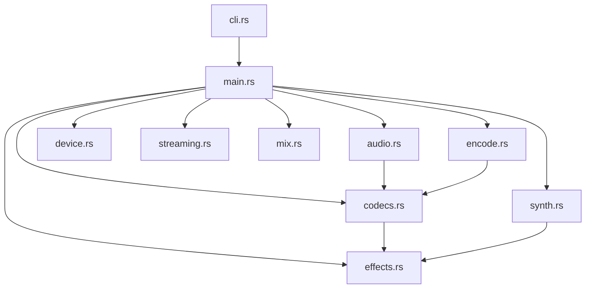
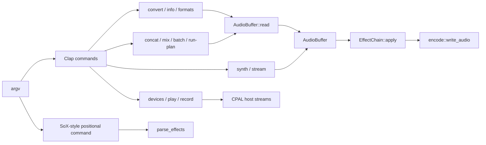

# soundx Knowledge Map

This map reflects the current Rust source layout. The compatibility matrix in
`SOX_COMPATIBILITY.md` is the authoritative list of supported formats, effects,
and device limitations.

## Module and data flow

- `AudioBuffer` is the shared interleaved `f32` representation used by decode,
  effects, synthesis, mix, and encode flows.
- WAV/AU/RAW, GSM, AMR, and WavPack use dedicated paths; Symphonia handles the
  general compressed/container decoder path.
- `EffectChain` applies parsed effects in order. SoX-style CLI tokens are
  parsed by `parse.rs`; subcommands use Clap argument structs in `cli.rs`.
- CPAL device commands are separate from file conversion: `devices` enumerates,
  `play` converts and concatenates a playlist before output, and `record`
  captures finite or continuous WAV input.
- `streaming.rs` is an incremental WAV path for gain, fade, and limiter. It does
  not use the full-buffer codec/effect pipeline.

## CLI routing

Current commands are `info`, `formats`, `devices`, `play`, `record`, `convert`,
`concat`, `mix`, `synth`, `stream`, `batch`, and `run-plan`.

## Codec and effect boundaries

- ADPCM output is WAV IMA (1–8 channels) or Microsoft ADPCM (1–2 channels).
- GSM uses mono 8 kHz raw frames. AMR uses mono NB/WB storage frames. WavPack
  support is lossless v5 mono/stereo; hybrid/lossy, DSD, correction, legacy,
  and multichannel streams are outside the implemented subset.
- `dither`, `compand`, `reverb`, `stretch`, and `tempo` are native Rust effects.
  Their behavior and grammar are approximations, not sample-exact SoX parity.
- Continuous recording writes 16-bit PCM WAV through a bounded queue. Multi-file
  playback currently holds the converted playlist in memory.

## Dependencies and verification

- `symphonia` 0.6.1: general compressed/container decoding.
- `oxideav-adpcm` and `oxideav-gsm`: WAV ADPCM encoding and GSM 06.10 frames.
- `rvoip-codec-core`: AMR-NB/WB codec and storage frames.
- vendored `wavicle` 0.1.0: WavPack v5 lossless mono/stereo.
- `hound`: WAV I/O; `cpal`: host audio devices; `clap`: CLI; `serde` and
  `serde_json`: JSON plans and metadata.

`cargo test --locked --all-targets` covers codecs, CLI paths, effect behavior,
and synthetic device-writer/playlist behavior. It does not validate physical
microphones/speakers or establish SoX sample parity.
